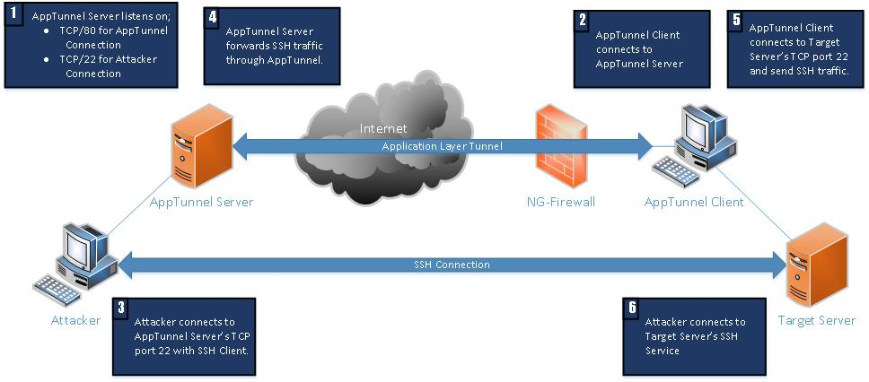

# APPTUNNEL

Apptunnel tool can create application level tunnels to hide traffic and needs a ***server***, which is outside the network, and a ***client***.
Apptunnel can mimic every ***HTTP and HTTPS application***.
HTTPS mode can bypass default settings of ***SSL Inspection*** for several applications.

Change Log:
- v1.1: Apptunnel now supports both directions, internal to internet and internet to internal
- v1.0: Apptunnel is currently allow you to access internet from internal network.

Access modes; 
    - Access internal: Access internal network from internet.
    - Access internet: Access internet from internal network

Server; listens for apptunnel connections.

    - tunnelip and tunnelport parameters are IP address and port to listen as apptunnel server.
    - proxyip and proxyport parameters are IP address and port to listen or connect.

Client; connects to both apptunnel server and target server.

    - tunnelip and tunnelport parameters are IP address and port of apptunnel server instance.
    - proxyip and proxyport parameters are IP address and port to listen or connect.

#### Usage: ####

    -h, --help              Show this help message and exit
    -c, --client            Run as client
    -ai, --access_internal  Access internal network from internet.
                            Default: Access to internet from internal network.
    -tip TUNNELIP, --tunnelip TUNNELIP
                        AppTunnel ip address
    -tp TUNNELPORT, --tunnelport TUNNELPORT
                        AppTunnel port.(default: 80)
    -pip PROXYIP, --proxyip PROXYIP
                        Server: IP address to listen as proxy
                        Client: IP address of target system
    -pp PROXYPORT, --proxyport PROXYPORT
                        Server: Port to listen as proxy
                        Client: Port of target system.
    -hp HOST_PARAMETER, --host_parameter HOST_PARAMETER
                        Host parameter Eg: "facebook.com", ...
    --ssl                 Enable ssl mode
    --ssl_cn SSL_CN       SSL Certificate Canonical Name (CN) Eg: "*.skype.com", ...
    -d, --debug           Enable debug logging
    -s, --silent          Silent mode, logging completely disabled

#### Sample applications ####
Some sample application can be found at [sample_module_options.json](sample_module_options.json).

